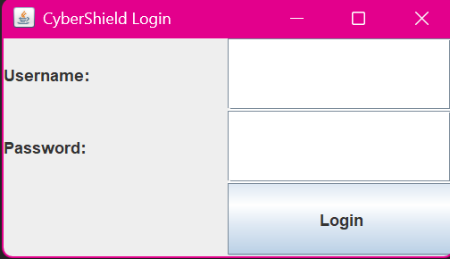
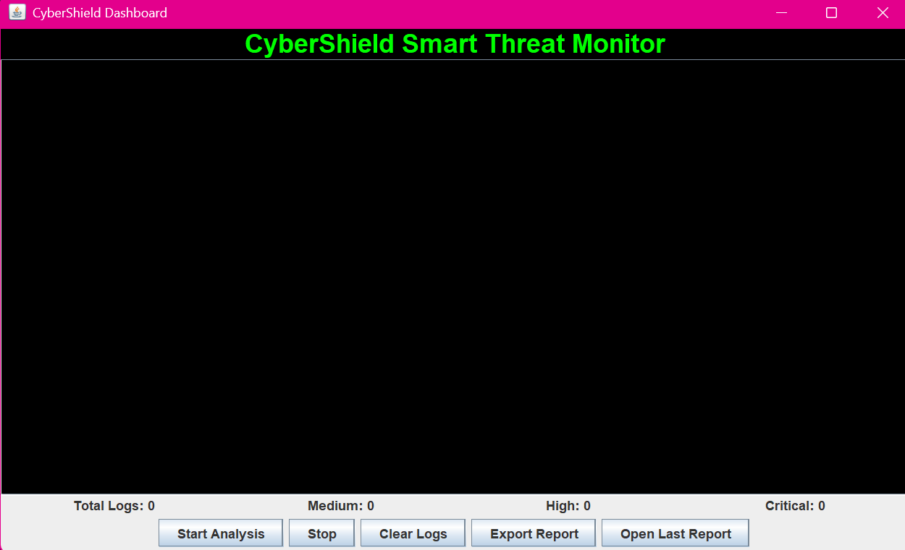
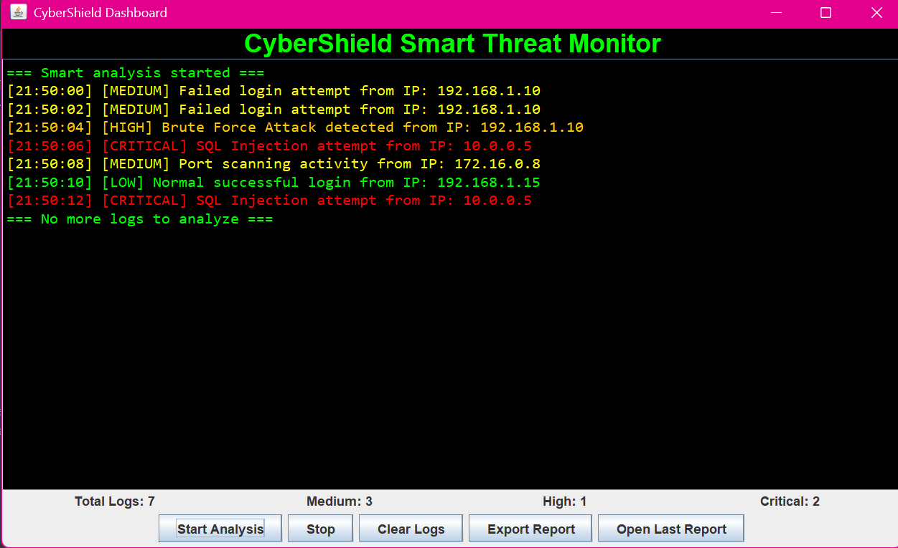
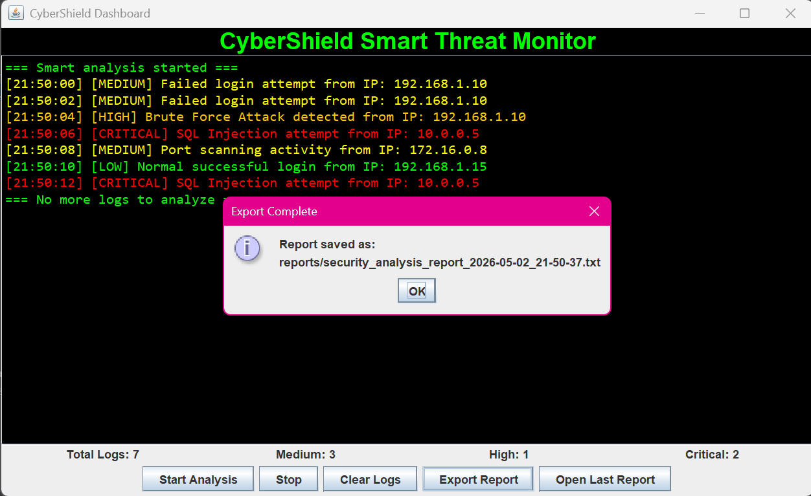
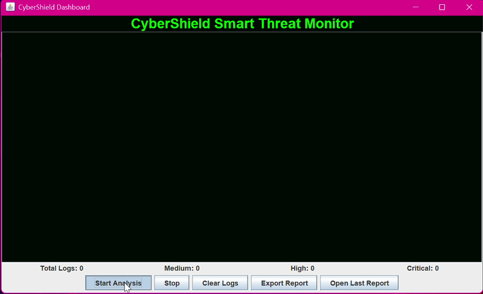

# CyberShield Dashboard

A Java-based cybersecurity dashboard that analyzes security logs, detects threats, classifies severity levels, and generates security reports.

---

## Features
- Real-time log analysis
- Threat classification (LOW, MEDIUM, HIGH, CRITICAL)
- Audible alert for CRITICAL threats
- Exportable security reports
- Open last generated report
- Interactive GUI dashboard

---

## Login Screen

---

## Dashboard

---

## Critical Alert

⚠️ When a CRITICAL threat is detected, the system triggers an audible alert to notify the user immediately.

---

## Report Export

---

## Demo (Preview)

---

## Full Demo with Sound
[Watch Video](CyberShield-Media/demo.mp4)

---

## Technologies Used
- Java
- Swing GUI
- OOP Concepts
- File Handling
- Exception Handling

---

## Project Overview
This project simulates a cybersecurity monitoring system that processes log data, identifies suspicious behavior, and alerts the user through visual and audio signals.

---

## Author
ENG. Saja 
